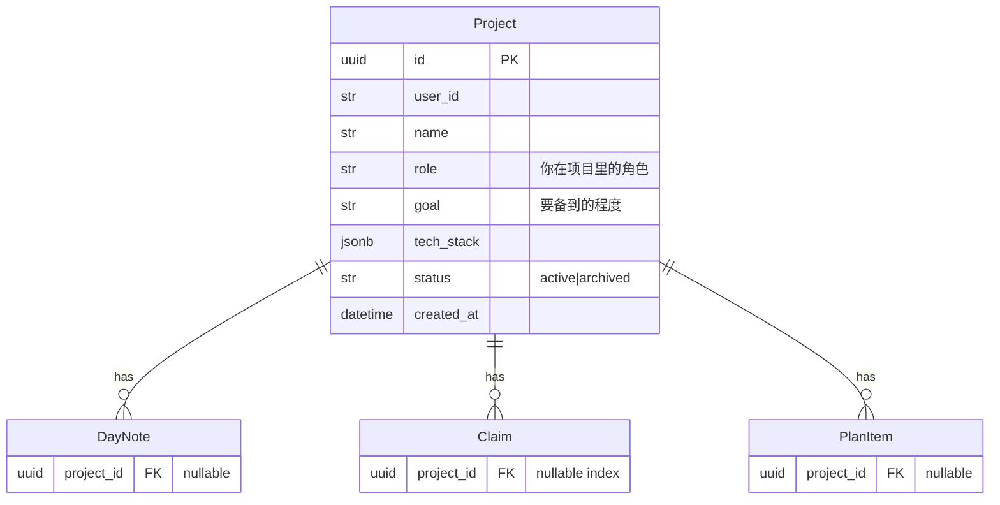

# Design — Project drill + 人格化

## 数据模型

新增 `ProjectRow`；`DayNoteRow`/`ClaimRow`/`PlanItemRow` 加 nullable `project_id`。Alembic `0003_project_drill`。

## DTO（core/models.py）
- `Project`：id, name, role, goal, tech_stack, status, created_at
- `ProjectProgress`：claims_total, mastered, in_progress, not_yet
- `SageVerdict`：done, depth_reached, gaps, follow_up

## ops（db/ops.py）
- `create_project / list_projects / get_project / update_project / archive_project`
- `list_project_claims / list_project_notes / project_progress`
- `add_note` / `ingest_note` 接受可选 `project_id`（claim 继承 note 的 project_id）

## Sage agent（core/agents/sage.py 新建）
- `build_sage_agent(model, system_prompt)` + `run_sage(agent, reader, project_card, answer, history) -> SageVerdict`
- prompt：`prompts/sage.md`（桑迪人格 + 项目深挖追问指令）
- 多轮：首轮无 answer → Sage 抛开场追问；后续带 answer+history → 追问或收尾给 gaps

## 人格化
- `prompts/{axiom,compass,echo,sage}.md` 顶部加人格段（章鱼哥/海绵宝宝/派大星/桑迪）
- 前端：agent 头像/称呼用角色名，bubble 语气保持角色感
- 记忆连续：agent 读取 memory（已有 MemoryReader），记住用户薄弱点/偏好

## REST（api/routes.py）
- `GET /v1/projects`、`POST /v1/projects`、`GET /v1/projects/{id}`、`PATCH /v1/projects/{id}`
- `GET /v1/projects/{id}/progress`
- `POST /v1/projects/{id}/drill`（body: {answer?, history?} → SageVerdict）
- `POST /v1/days/{day}/notes` 加可选 `project_id`

## MCP（mcp/server.py）
- `gotit_list_projects` / `gotit_add_project` / `gotit_get_project` / `gotit_update_project`
- `gotit_drill_project(project_id, answer?, history?)`
- `gotit_ingest_note` / `gotit_add_note` 加可选 `project_id`

## UI（App.tsx + styles.css）
- 左栏顶部项目切换器（chip 横排：「全部」「项目A」「项目B」「+」）
  - 选项目：左栏资料过滤为该项目；右栏考我聚焦该项目考点
  - 全部：今日全局视图（现状）
- 右栏 segmented 第三档：`[考我] [回讲] [项目深挖]`
- 项目深挖模式：顶部项目卡片（role/goal/tech_stack，可编辑）+ Sage 多轮追问对话 + 缺口提示
- 新建/编辑项目 modal
- agent 头像/称呼人格化（章鱼哥/海绵宝宝/派大星/桑迪）
