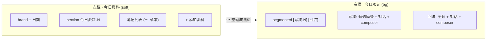

# Design — UI layout rework

## 布局

## 状态

新增 `mode: "examine" | "teach"`，默认 `examine`。`showTeach` modal 废弃，回讲内联右栏。
`showCompose` modal 保留但仅含资料类 tab（手写/链接/文件）；手动加题与补回顾改为右栏考我模式的小入口。

## 笔记 ⋯ 菜单

笔记项右侧 ⋯ 按钮，点击切换 `openMenuId`（笔记 id），弹绝对定位下拉：
- 查看 → `onOpenNote`
- 整理成测验 → `onIngestNote`
- 删除 → `onDeleteNote`
点外部关闭（overlay 透明层或 onBlur）。

## 考我题选择条

横向小卡列表（`items`），当前 `active` 高亮，点击 `setSelectedId`。替代原左栏队列。题太多时横向滚动。

## 空状态

- 左栏空：「还没有资料。点 + 添加资料，写完后可整理成测验题。」
- 考我无题：「今天还没有要考的题。从左侧笔记「整理成测验」，或 + 手动加题。」
- 回讲空：「输入一个主题，开始讲给 Echo 听。」

## 样式

- `.segmented` / `.segmented-tab`：Apple 胶囊切换，active 实心 ink
- `.note-menu` / `.note-menu-pop`：⋯ 按钮 + 绝对定位下拉
- `.claim-tabs` / `.claim-tab`：横向题选择条
- 左右栏底色对比（`--soft` / `--bg`）已有，强化 section 标题
